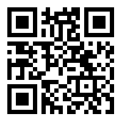

# User Manual
This user manual servers a guide to use core features of the application. Please note this is a prototype application and is not meant for production use.

Additional documentation: https://kalimotxo.herokuapp.com/documentation

## Access Web App
1. Open a web browser on your mobile device
2. Navigate to https://kalimotxo.herokuapp.com

## Log In/Register
### Create Customer Account
1. Tap "Log in" on the top right of screen.
2. Tap "Register" link.
3. Complete the form. NOTE: You will **not** receive email notifications. Please remember the email and password used to create your account.
4. In the drop down, select "Customer".
5. Click "Register".

### Create Bartender Account
1. Tap "Log in" on the top right of screen.
2. Tap "Register" link.
3. Complete the form. NOTE: You will **not** receive email notifications. Please remember the email and password used to create your account.
4. In the drop down, select "Bartender".
5. Click "Register".

### Rate a bartender
1. Log in using a "Customer" account.
2. Tap the menu icon on the top left of screen.
3. Select "Scan QR Code".
4. If prompted, allow access to camera.
5. Scan a QR bar code. You may use the one provided below or one created from a Bartender's account.

6. Select star rating and enter comments.
7. Click "Save Rating".

### Access Profile
1. Log in using any account type
2. Click your email address in the top right of screen
3. Click "Profile"

#### Customer Profile
Customers will see their information as well as all the ratings they have given.

#### Bartender Profile
Bartenders will have their unique QR code displayed. This will be provided to customers to scan their code and leave a rating.

#### Business Profile
Business users will see their information used when creating their account.

### Access Map
1. Log in using any account type
2. Tap the menu icon on the top left of screen.
3. Select "Heat Map".
4. Zoom in/out to view other locations of customer comments.

### Access Dashboard
NOTE: This view is only available for Business users. It lists all ratings made at the searched location.
1. Log in using a Business account
2. Tap the menu icon the top left of screen
3. Click on "Dashboard"
4. Search for a location.

### Log Out
1. Click on your email address on the top right of screen
2. Click "Log out"